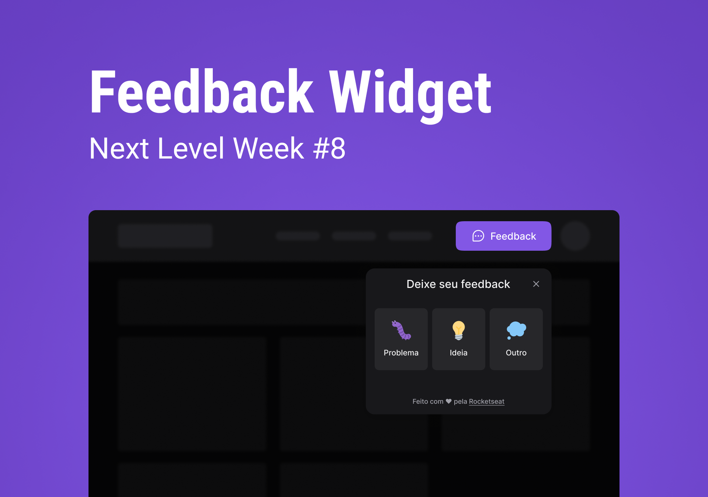

  

## 💻 Project

The developed project is an application for collecting feedback that can be added to any mobile or web environment.

This is a project developed during Next Level Week, presented by Rocketseat.

## 🎯 Features

- Sending feedback
- Screenshot with html2canvas
- Use of MailTrap to send emails with feedbacks

##    Technologies

This project was developed with the following technologies:

- Node.js
- react
- Tailwindcss
- Vite
- TypeScript
- Express
- Prism
- PostgreSQL
- Jest

## 🔖 Layout

You can view the layout of the project via the link below:

- [Web Layout](https://www.figma.com/community/file/1102912516166573468/Feedback-Widget)

## 📝 License

This project is under the MIT license. See the [LICENSE](LICENSE.md) file for more details.

-----

Made by Breno.

